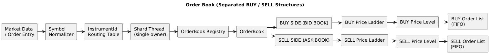
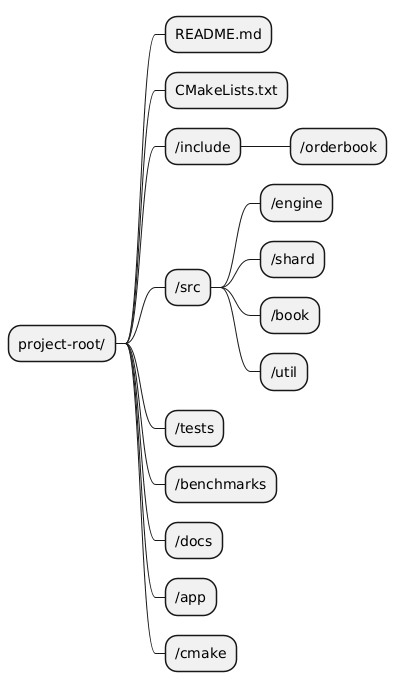

# High-Performance Sharded Order Book Engine

A low-latency, single-writer-per-shard limit order book engine designed for deterministic execution, cache-efficient data access, and scalable multi-instrument trading.

---

## Overview

This project implements a high-performance limit order book architecture for systems where latency, predictability, and correctness matter.

The design is centered on a **sharded ownership model**:

- each shard owns a subset of instruments,
- each shard is processed by a dedicated thread,
- each order book is mutated by only one writer,
- the hot path avoids internal locking.

This keeps the matching path simple, fast, and easy to reason about.

---

## Design

### System Flow



### Core Principles

#### Shard ownership

Each shard owns its order books and executes all mutations on a single thread. This removes shared mutable state from the matching path.

#### Precomputed routing

Symbols are resolved into stable `InstrumentId` values before entering the hot path. Routing then becomes a direct lookup from `InstrumentId` to `ShardId`.

#### Book-local matching

Each order book is responsible for its own matching, sweeping, cancel, and modify logic.

#### FIFO at each price

Orders at the same price are stored in arrival order using an intrusive doubly linked list.

#### Fast cancel/modify

An order-id index provides direct access to the order node, enabling efficient cancel and modify operations.

## Data Structures

|Component|Structure|Purpose|
|---|---|---|
|Symbol registry|Hash map / cold-path table|Symbol → InstrumentId|
|Routing table|Array or flat map|InstrumentId → ShardId|
|Shard registry|Hash map|InstrumentId → OrderBook|
|OrderBook|Single-owner object|Market state for one instrument|
|Price ladder|Fixed array + bitset or `std::map`|Price-level navigation|
|Price level|Intrusive doubly linked list|FIFO queue at one price|
|Order index|Hash map|OrderId → OrderNode*|

---

## Matching Model

The matching engine follows price-time priority:

1. Find the best opposite-side price level.
2. Consume orders in FIFO order at that level.
3. Continue sweeping until the incoming order is filled or the book is exhausted.
4. Remove empty price levels immediately.

This makes the sweep path a deterministic traversal over the price ladder and order queue.

---

## Complexity

|Operation|Time Complexity|Memory Complexity|Notes|
|---|---|---|---|
|Symbol → InstrumentId|O(1) |O(N)|Cold path only|
|Instrument → Shard|O(1)|O(N)|Direct routing lookup|
|OrderBook lookup|O(1) |O(M)|M = books in shard|
|Add order|O(1) or O(log P)|O(1)|Depends on price ladder|
|Cancel order|O(1) |O(1)|Via order index|
|Modify order|O(1) |O(1)|Via order index|
|Sweep / match|O(K + P)|O(1)|K = fills, P = price levels touched|
|Best bid / ask|O(1) or O(log P)|O(1)|Depends on ladder strategy|

---

## Price Ladder Strategy

Two ladder implementations are supported.

### Fixed array + bitset

Best for dense and bounded tick ranges.

Pros:

- O(1) access
- excellent cache locality
- very fast best-price lookup

### Balanced tree (`std::map`)

Best for sparse or wide price spaces.

Pros:

- simple and flexible
- predictable logarithmic operations
- suitable fallback when the tick universe is not compact

---

## Order Level Structure

Each price level contains:

- a price,
- aggregate quantity,
- head/tail pointers,
- an intrusive doubly linked list of orders.

---

## Concurrency Model

- one thread owns one shard,
- one shard owns many order books,
- one order book is mutated by only one thread,
- no internal mutexes in the hot path.

Concurrency is handled at the boundaries:

- ingestion,
- routing,
- shard dispatch,

---

## Benchmarks
Benchmarks will be added as the project gets mature.

---

## Implementation Plan

### Phase 1 — Core types

- [ ] `InstrumentId`
- [ ]  `ShardId`
- [-]  `OrderId`
- [-]  `Price`
- [-]  `OrderNode`
- [ ]  basic `OrderBook`

### Phase 2 — Routing

- [ ]  symbol registry
- [ ]  instrument normalization
- [ ]  routing table
- [ ]  shard assignment

### Phase 3 — Shard engine

- [ ]  thread-per-shard execution
- [ ]  shard-local registry
- [ ]  order dispatch queue

### Phase 4 — Price ladder

- [ ]  `std::map` implementation
- [ ]  fixed array + bitset implementation
- [ ]  best bid / ask lookup

### Phase 5 — Matching

- [ ]  sweep logic
- [ ]  partial fill handling
- [ ]  price-time priority
- [ ]  level deletion on empty

### Phase 6 — Order management

- [ ]  order-id index
- [ ]  cancel path
- [ ]  modify path

### Phase 7 — Optimization

- [ ]  pool allocator
- [ ]  cache-line alignment
- [ ]  branchless inner loops
- [ ]  NUMA-aware placement
- [ ]  benchmark-driven tuning

## Build

### Requirements

- C++23 compiler
- CMake 3.20+
- Linux recommended for affinity and NUMA control

### Build

```
cmake -B build
cmake --build build -j
```

### Run

```
./build/orderbook
```

---

## Project Structure

.


---

## Status

This project is in active development.

Current focus:

- architecture validation
- correctness of matching logic
- shard ownership model
- benchmark scaffolding
- latency-oriented implementation choices

---

## Acknowledgments

This project is built around standard systems principles used in low-latency trading engines:

- sharding,
- ownership isolation,
- intrusive structures,
- and cache-aware design.
